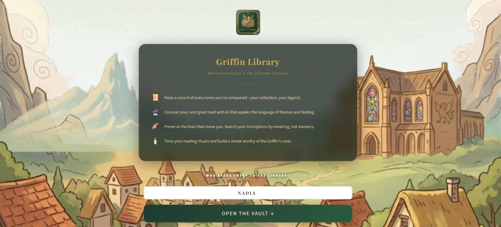
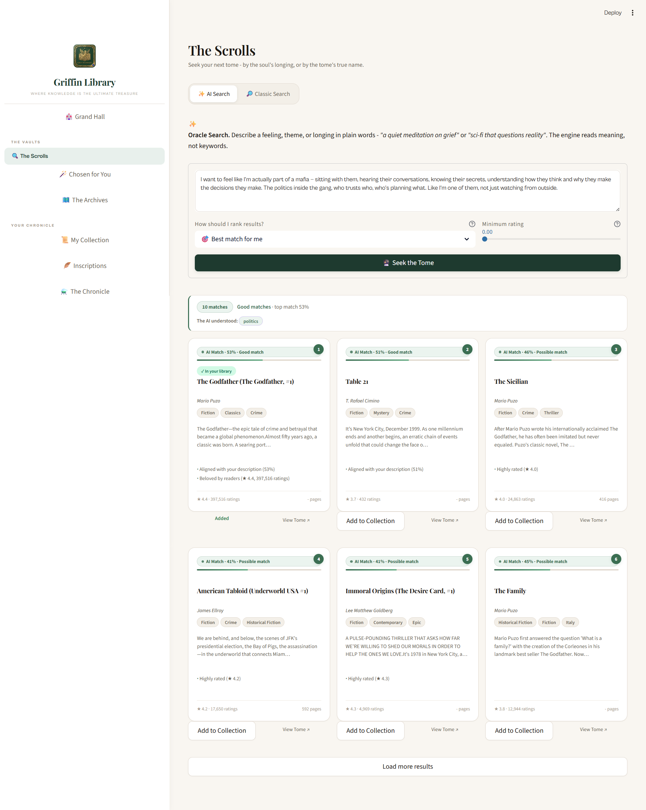
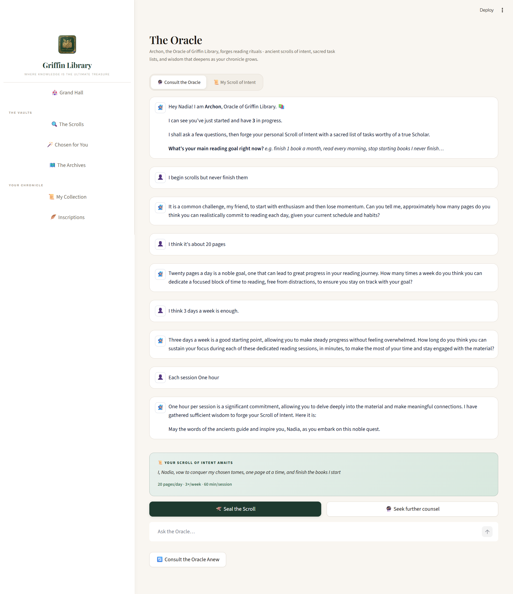
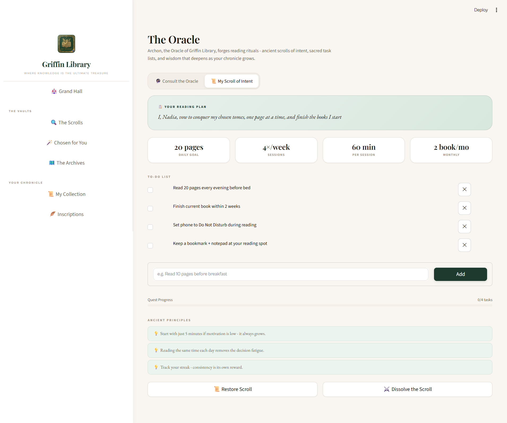
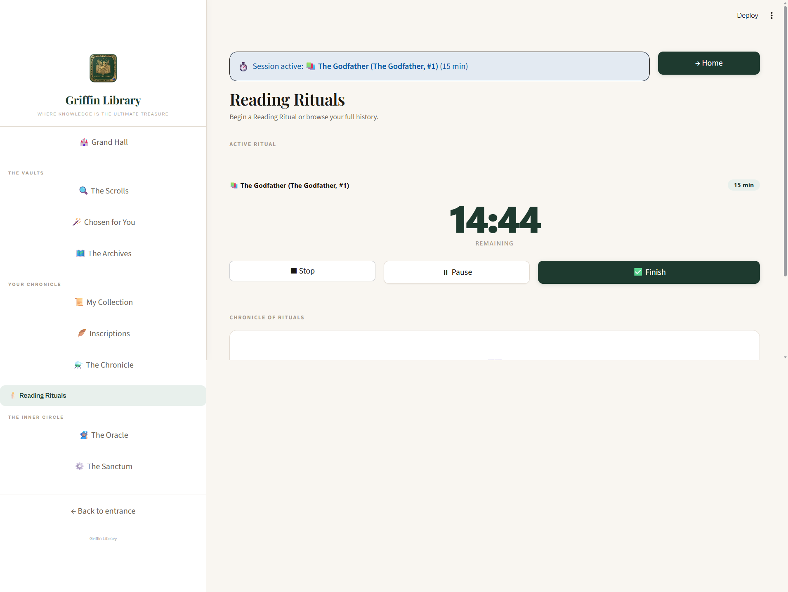
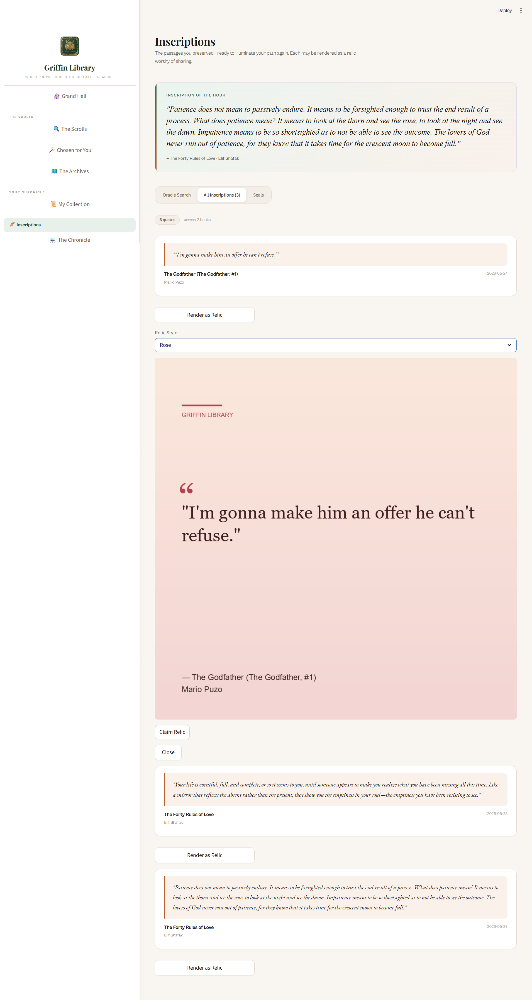
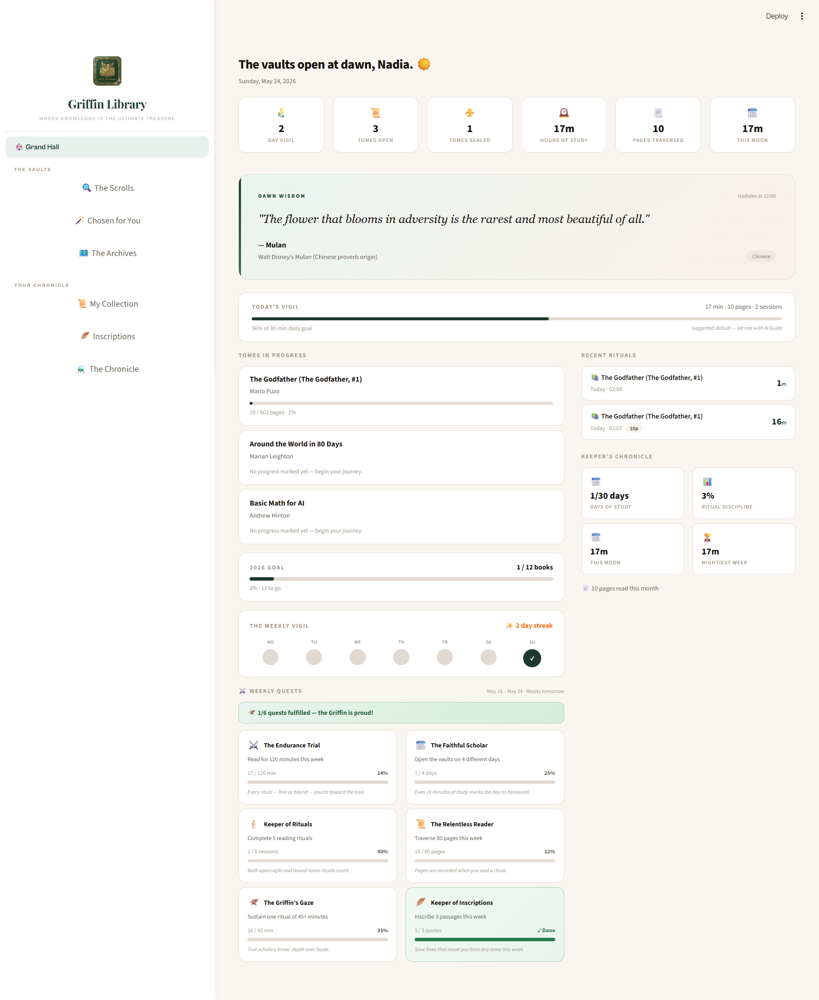

<div align="center">


# Griffin Library

### *Where knowledge is the ultimate treasure*

An AI-powered personal reading companion built with Python and Streamlit.
Search books by feeling, track your reading rituals, preserve quotes, and get personalized recommendations - all in one place.

[](https://python.org)
[](https://streamlit.io)
[](https://faiss.ai)
[](LICENSE)

</div>

---

## What is Griffin Library?

Griffin Library is a personal reading tracker that goes beyond lists and checkboxes. It combines semantic AI search, personalized recommendations, quote management, and reading session timers - all wrapped in a lore-inspired interface that makes reading feel like an adventure.

---

## Features

### The Scrolls - AI Book Search
Describe a feeling, a mood, or a theme in plain words. The Oracle reads meaning, not keywords.

> *"I want to live inside the mind of someone the world calls a villain - understand every decision, every scar that made them this way, every moment that could have gone differently. Not to justify it. Just to finally understand how a person becomes what they become."*

The engine returns semantically matched books with confidence scores, match reasons, and genre chips.

Also includes a Classic Search mode for searching by title, author, or genre with filters.

---

### Chosen for You - Personalized Recommendations
After you rate and read a few books, the Oracle builds a 768-dimensional taste profile from your library and finds undiscovered books closest to your reading soul.

Results explain exactly why each book was chosen, with MMR re-ranking to ensure variety.

---

### The Archives - Catalog Insights
A read-only analytics view of the full catalog: 8,577 books, 4,960 unique authors, 608 genres. Browse top-rated books, most popular titles, genre distributions, and more.

---

### My Collection - Personal Library
Organize books across four shelves: In Progress, To Acquire, Sealed (read), and My Tomes (custom entries).

For each book you can track page progress, leave a rating, write Scholar's Notes, and inscribe passages with page numbers and custom tags.

When a book is sealed, the Griffin celebrates with you.

---

### Inscriptions - Quote Management
Every passage you save is searchable by meaning using the Oracle Search engine.

> *"something about how patience is actually a form of wisdom, not weakness"*

Quotes can also be exported as styled PNG images (Render as Relic) in five visual palettes: Ink, Rose, Sage, Ocean, Violet.

---

### Reading Rituals - Session Timer
Start a timed reading session linked to a specific book (Bound Ritual) or as free exploration (Open Vigil). The live countdown timer tracks your session, and when you finish you record your page progress directly.

All sessions are logged with timestamps, pages read, and duration. The full history is filterable and sortable.

---

### The Oracle - AI Reading Coach
Archon, the Oracle of Griffin Library, asks you a few questions about your reading goals and forges a personalized Scroll of Intent: a reading plan with daily pages, sessions per week, and a task board you can check off and customize.

---

### Grand Hall - Dashboard
Your personal reading dashboard: KPI strip, daily quote from world literature, books in progress with page progress bars, weekly streak calendar, and six weekly reading challenges.

---

## Screenshots

### Welcome


### AI Search - The Scrolls


### The Oracle - Consultation


⚠️ Oops! The conversation continued after the screenshot - that's why the plan shows 4×/week based on my responses. 🙂


### The Oracle - Scroll of Intent


### Reading Rituals - Live Timer


### Inscriptions - Quote Export


### Grand Hall - Dashboard



---

## Data Pipeline

The recommendation engine was built from two merged datasets using a 6-notebook pipeline:

| Step | Notebook | Output |
|---|---|---|
| Data Understanding | `01_data_understanding.ipynb` | Dataset decision |
| Clean and Merge | `02_clean_merge.ipynb` | `books_merged.csv` - 8,577 books |
| EDA | `03_eda.ipynb` | Insights and patterns |
| Feature Engineering | `04_feature_engineering.ipynb` | `books_features.csv` - 15 columns |
| Model | `05_model.ipynb` | `book_index.faiss` + `books_cleaned.pkl` |
| Validate | `06_validate.ipynb` | Quality review |

**Sources:** Goodreads ratings data + CMU Book Summaries corpus
**Model:** `all-mpnet-base-v2` (768-dim sentence embeddings)
**Index:** FAISS `IndexFlatIP` - exact cosine search over 8,577 books
**Scoring:** Hybrid (semantic score + rating_norm + popularity_norm) with MMR re-ranking

---

## Tech Stack

| Layer | Technology |
|---|---|
| Interface | Streamlit |
| Semantic Search | Sentence Transformers (`all-mpnet-base-v2`) |
| Vector Index | FAISS (`IndexFlatIP`) |
| Data Validation | Pydantic v2 |
| AI Coach | Groq API (LLaMA) |
| Image Export | Pillow |
| Storage | Atomic JSON with automatic daily backups |

---

## Project Structure

```
Griffin-Library/
├── app/
│   ├── views/          # All page views (home, discover, sessions, etc.)
│   └── styles/         # main.css design system
├── core/               # Business logic (library, recommender, storage, etc.)
├── notebooks/          # Data pipeline (01 through 06)
├── tests/              # Unit tests for library and validation
├── static/             # Logo and background assets
├── app.py              # Application entry point
├── requirements.txt
├── LICENSE
└── README.md
```

---

## Getting Started

### 1. Clone the repository
```bash
git clone https://github.com/SuraSammour12/Griffin-Library.git
cd Griffin-Library
```

### 2. Install dependencies
```bash
pip install -r requirements.txt
```

### 3. Build the model files

Run the notebooks in order inside the `notebooks/` folder to generate:
- `models/book_index.faiss`
- `models/books_cleaned.pkl`

You will need the raw datasets (Goodreads + CMU Book Summaries) placed in `data/raw/`.

### 4. Set up the Groq API key (for The Oracle)

Create a `.streamlit/secrets.toml` file:
```toml
GROQ_API_KEY = "your_key_here"
```

### 5. Run the app
```bash
streamlit run app.py
```

---

## License

MIT License - Copyright (c) 2026 Sura Sammour

See [LICENSE](LICENSE) for full terms.
